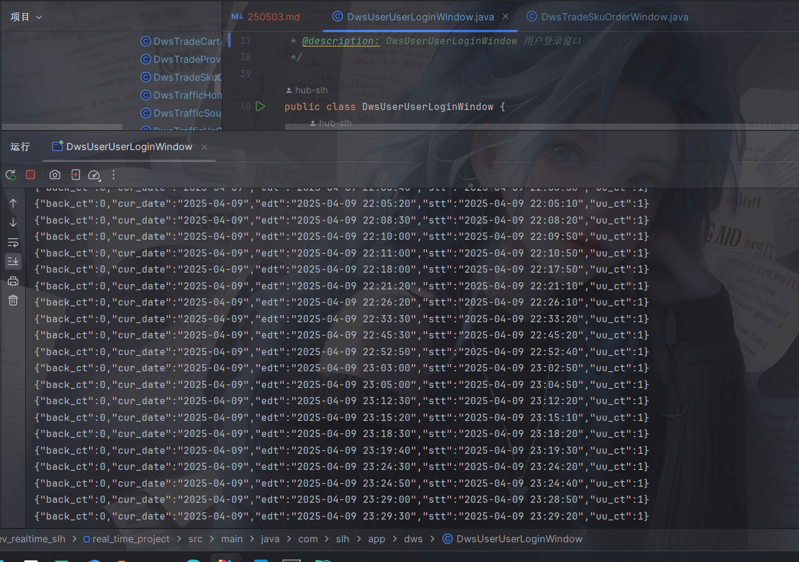

> 今日任务
* 1.dwd层 数据仓库明细层基础日志表
* 
* 2.dwd层 数据仓库明细层 互动评论信息表
* 
* 3.dwd层 数据仓库明细层 购物车添加表
* 
* 4.dwd层 数据仓库明细层 订单详情表
* 
* 5.dwd层 数据仓库明细层 订单取消详情表
*  
* 6.dwd层 数据仓库明细层 订单支付成功详情表
* 
* 7.dwd层 数据仓库明细层 订单退款表
* 
* 8.dwd层 数据仓库明细层 退款支付成功详情表
* 
* 9.dws层 交易购物车添加Uu窗口
* 
* 10.dws层 交易省份订单窗口
* 
* 11.dws层 流量首页详情页浏览窗口
* 
* 12.dws层 流量来源关键词页浏览窗口
* 
* 13.dws层 流量VcChArls新页面浏览窗口
* 
* 14.dws层 用户登录窗口
* 
* 15.dws层 交易库存单位订单窗口
* 