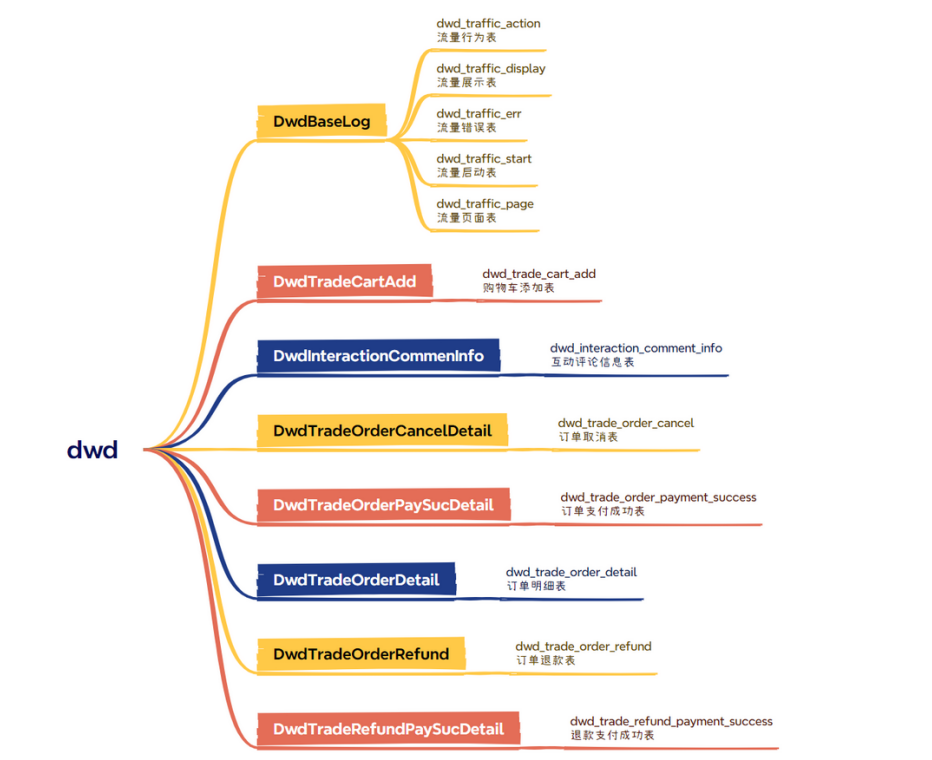
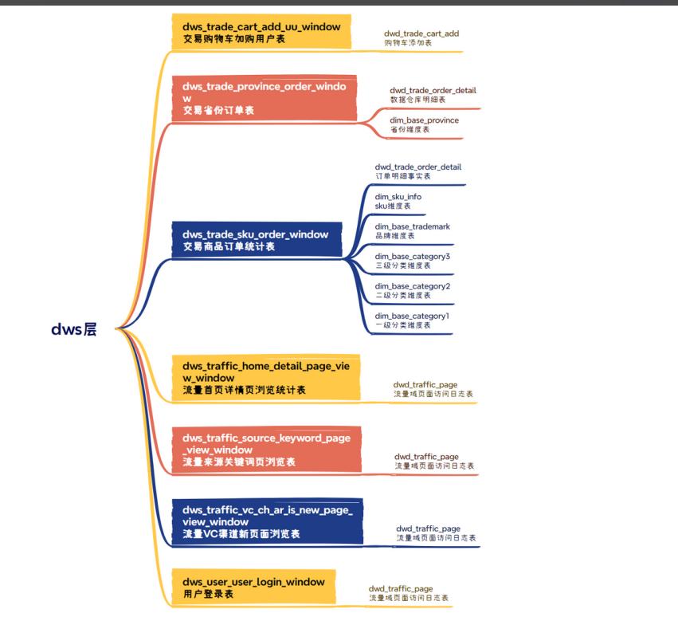
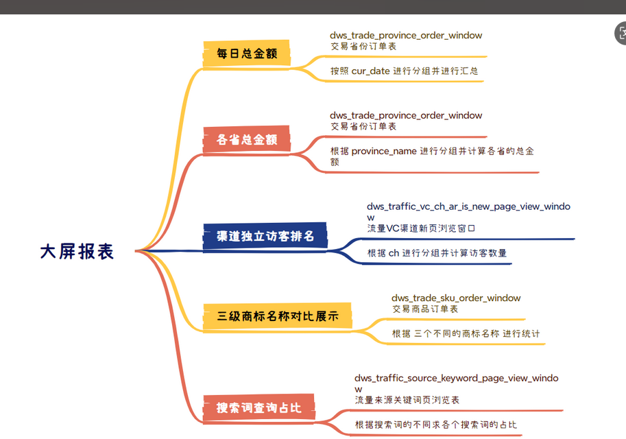

> 今日任务
* 项目介绍文档
* Flink电商实时数仓项目讲解文档
  一、项目背景
  随着电商平台业务的快速发展，传统的离线数仓已无法满足对实时数据分析和决策的需求。实时数仓能够对用户行为、交易、商品等数据进行秒级处理和分析，帮助企业实现实时监控、风控、推荐和运营决策。
  二、项目目标
  搭建一个基于Flink的电商实时数仓系统
  实现对用户行为、订单、商品等多源数据的实时采集、清洗、聚合和分析
  支持实时大屏展示、实时报表、实时预警等应用场景
  三、整体架构
  Apply
1. 数据源
   日志数据
   业务数据
2. 数据采集
   通过前端埋点采集用户的信息到.log文件，通过flume上传到Kafka(topic_top)
   使用 Flink CDC 同步 MySQL 数据到Kafka(topic_db)
3. 实时处理
   Flink消费Kafka数据，进行实时ETL、清洗、维表关联、聚合等
4. 数据存储
   Kafka（消息队列，解耦上下游）
   HBase/Redis（维表、宽表存储）
5. 数据应用
   实时大屏
   实时报表
   四、数仓分层设计
1. ODS（Operational Data Store，操作数据存储层）
   作用：原始数据的接入层，保留数据的原始性
   处理：数据格式统一、简单清洗
2. DWD（Data Warehouse Detail，明细层）
   作用：对ODS层数据进行进一步清洗、去重、结构化，形成业务明细数据
   处理：数据解析、字段补全、维表关联
3. DWS（Data Warehouse Summary，汇总层）
   作用：对DWD层数据进行聚合，形成宽表或主题宽表
   处理：多维度聚合、窗口计算
4. ADS（Application Data Store，应用层）
   作用：为具体业务应用提供数据支撑，如实时报表、实时大屏
   处理：指标计算、数据输出
   五、技术选型
   Flink：核心实时计算引擎，支持高吞吐、低延迟、Exactly-Once语义
   Kafka：高性能消息队列，数据解耦
   HBase：维度表存储与关联
   六、核心模块与实现要点
   数据采集：
   业务数据：
   通过Flink CDC 将 Mysql 数据库中的 dev_realtime_v1 库中的全部表的数据上传至 Kafka 中的 topic_db 主题
   日志数据
   通过前端埋点采集用户的信息到.log文件，通过flume上传到 topic_log 主题
   维度数据处理
   使用 Flink CDC 读取 Mysql 中的 dev_realtime_v1_config 库中 table_process_dim 表在 HBase 中创建维度表，并将 kafka 中的 topic_db 主题中的数据写入 Hbase
   DWD层
   DwdBaseLog：
   处理基础日志数据
   分流处理不同类型日志(页面、启动、错误、曝光、动作)
   过滤脏数据并处理is_new字段

DwdInteractionCommenInfo：
处理用户评论互动数据
关联字典表获取评价名称

DwdTradeCartAdd：
处理购物车添加行为
计算商品数量变化

DwdTradeOrderDetail：
处理订单明细数据
关联订单信息、活动信息、优惠券信息

DwdTradeOrderCancelDetail：
处理订单取消业务
关联取消订单和订单明细数据

DwdTradeOrderPaySucDetail：
处理支付成功业务
关联支付信息和订单明细

DwdTradeOrderRefund：
处理订单退款业务
关联退款信息、订单信息和省份信息

DwdTradeRefundPaySucDetail：
处理退款支付成功业务
关联退款支付、退单和订单信息
业务价值
这些程序构建了数据仓库的明细层，为后续的数据分析、报表和数据服务提供了高质量的、结构化的基础数据，支撑了电商平台的关键业务分析需求，如用户行为分析、交易分析、商品分析等

DWS层
1.DwsTrafficHomeDetailPageViewWindow.java
功能：流量域首页和详情页独立访客统计窗口

2. DwsTrafficSourceKeywordPageViewWindow.java
   功能：流量来源关键词页浏览窗口

3. DwsTrafficVcChArIsNewPageViewWindow.java
   功能：流量VC新页面浏览窗口

4. DwsUserUserLoginWindow.java
   功能：用户登录窗口统计

5. DwsTradeSkuOrderWindow.java
   功能：交易域SKU粒度订单统计窗口

6. DwsTradeProvinceOrderWindow.java
   功能：交易域省份订单窗口统计

7. DwsTradeCartAddUuWindow.java
   功能：交易购物车添加独立用户窗口

七、总结
Flink电商实时数仓项目是大数据实时处理的典型应用，能够帮助企业实现数据驱动的实时运营和决策。通过合理的架构设计和技术选型，可以高效、稳定地支撑电商平台的实时数据需求。

* Xmind
* 
* 
* 
